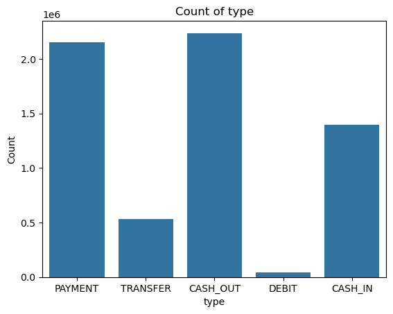

# Financial Fraud Detection -Basic Pipeline 

### This project focuses on detecting financial fraud using a variety of machine learning and deep learning models. The dataset used contains transactional data with features such as transaction type, amount, and balance changes. The goal is to develop effective models that can accurately classify transactions as either fraudulent or non-fraudulent.

## Creating an ensemble classifier (KNN and Logistic regression  model) that will assess if fraudulent activity has occurred for a transaction.

 ## This  list of columns, consider which columns might not be relevant to your analysis: 
 ## ● Step: A unit of time that represents hours in the dataset. Think of this as the timestamp of the transaction (e.g. hour 1, hour 2, … hour 534, …) 
 ## ● Type: The type of transaction 
 ## ● Amount: The amount of money transferred 
 ## ● NameOrig: The origin account name  
 ## ● OldBalanceOrg: The origin accounts balance before the transaction ● NewBalanceOrg: The origin accounts balance after the transaction 
 ## ● NameDest: The destination account name 
 ## ● OldbalanceDest: The destination accounts balance before the transaction ● NewbalanceDest: The destination accounts balance after the transaction 
 ## ● IsFlaggedFraud: A “naive” model that simply flags a transaction as fraudulent if it is greater than 200,000 (note that this currency is not USD) 
 ## ● IsFraud: Was this simulated transaction actually fraudulent? In this case, we consider “fraud” to be a malicious transaction that aimed to transfer funds out of a victim’s bank account before the account owner could secure their information. 

## 1. EDA 

## 
## 
## 

##  2.Data cleaning ,wragling & pre- processing

 ### Dropped null values, removing unnecessary columns, removing outliers,Encoding Categorical variables , created train test splits.

 ## 3. Data Modeling
 ### The chosen ensemble method used for this dataset had been the KNN,Gaussian Naive Bayes Model &Logistic Regression Model. 

## 4. Report

  ### 1. Which insights did you gain from your EDA? 
### Datas should be downsized in order to run smoothly. It could be seen with the isFraud hue that the only fraudulent cases are within the types 'TRANSFER' and 'CASH-OUT'.There were no null values to be seen within this dataset.According to correlation matrix oldbalanceDest and newbalanceDest have a very strong correlation. Amount is moderately correlated with both oldbalanceDest and newbalanceDest. isFraud has low correlations with most other features, pointing  that fraudulent activity may not be directly linked to simple numerical values like transaction amount or balances. It's depend more on Transaction type.

### 2. How did you determine which columns to drop or keep? If your EDA informed this process, explain which insights you used to determine which columns were not needed. 
### Based on the EDA, the nameOrig and nameDest columns these are unique account IDs and do not provide numerical or meaningful categorical patterns for analysis.As an example, the nameOrig and nameDest columns did not produce any graphical data in their univariate analysis.

### 3. Which hyperparameter tuning strategy did you use? Grid-search or random-search? Why? 
 ### I used  random-search due to how it is works well for large datasets compared to a grid search.

### 4. How did your model's performance change after discovering optimal hyperparameters? 

  ### knn= KNeighborsClassifier()
### random_search = RandomizedSearchCV(
### knn, param_distributions=param_dist, 
###   n_iter=10,  # Reduce number of iterations 
###   scoring='f1', cv=3,  # Reduce cross-validation folds from 5 to 3
 ###    random_state=42, n_jobs=-1
)
### random_search.fit(X_train,y_train)
### print("Best Hyperparameters:",random_search.best_params_)

### 5. What was your final F1 Score? 
###           precision    recall  f1-score   support

  ### Not Fraud       1.00      1.00      1.00   1906351
  ###  Fraud       0.36      0.41      0.38      2435

 ### accuracy                           1.00   1908786
### macro avg       0.68      0.70      0.69   1908786
### weighted avg       1.00      1.00      1.00   1908786

### Accuracy: 1.00

### The Final scoring is 1 indicating high precision and recall